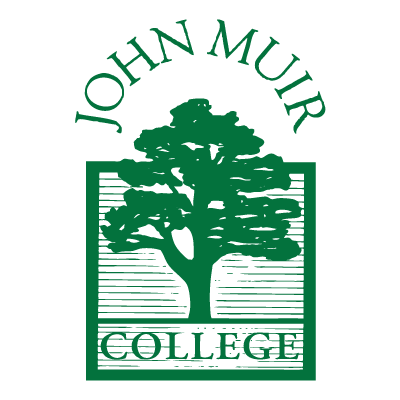

# Enzo's User Page

```Cpp
int main() {
  cout << "Welcome to my page!";
  return 0;
}
```

## Overview
Hi, I'm Enzo, a 3rd year student at UCSD pursuing a B.S. in Computer Science with a minor in Mathematics. This page is an introduction about me.

Sections:
1. [Overview](https://edeolive.github.io/CSE110-Lab1/#overview)
2. [About Me as a CS Student](https://edeolive.github.io/CSE110-Lab1/#about-me-as-a-cs-student)
3. [About Me Personally](https://edeolive.github.io/CSE110-Lab1/#about-me-personally)
	* [Sports](https://edeolive.github.io/CSE110-Lab1/#sports)
	* [Books](https://edeolive.github.io/CSE110-Lab1/#books)
	* [Music](https://edeolive.github.io/CSE110-Lab1/#music)
	* [Games](https://edeolive.github.io/CSE110-Lab1/#games)
4. [Closing](https://edeolive.github.io/CSE110-Lab1/#closing)

## About Me as a CS Student



As written previously, I am a 3rd year student studying Computer Science. I'm in Muir college. I also love math (I was originally a math major)! I am still figuring out what I want to focus on in Computer Science. Some areas I am currently interested in are security, cryptography, and machine learning.

During summer 2021, I worked as a STEP intern at Google. My project used `HTML`, `CSS`, and `JavaScript` on the frontend and `Java` and `SQL` on the backend. I learned a lot, and hope to return in the future.

## About Me Personally

### Sports
I like running and play a little bit of tennis and soccer.

### Books
I enjoy reading a lot. My favorite book is Kurt Vonnegut's *Slaughterhouse-Five*.


> Still–if I am going to spend eternity visiting this moment and that, I’m grateful that so many of those moments are nice.

\- Kurt Vonnegut, Slaughterhouse-Five

### Music
I played the viola as a kid, and have been playing the electric guitar for about a year.

I also like listening to rock/alternative/hip-hop music. If I had to pick a favorite song, it would probably be ["At the Door"](https://www.youtube.com/watch?v=9CAz_vvsK9M) from  *The New Abnormal*.


The cover of *The New Abnormal*, *Bird on Money* by Jean-Michel Basquiat, 1981

[Some of my favorite music from this year.](./albums.md)

### Games
I like to play video games, but don't have as much time anymore. One of my favorite series is the Dark Souls trilogy.


[Some of my favorite games.](./games.md)

## Closing
Thanks for visiting my page!

TODO:
- [x] Headings
- [x] Styling text
- [x] Quoting text
- [x] Quoting code
- [x] External Links
- [x] Section links
- [x] Relative links (Link to another .md file or an image in your repo. If linking to an image, encode it as a regular link rather than an image.)
- [x] Ordered and Unordered Lists
- [x] Task lists
